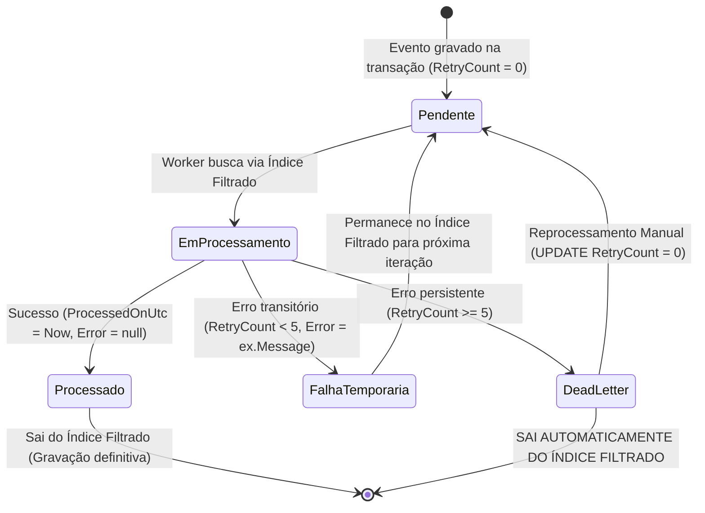

# ADR 001: Índices Filtrados e Mecanismo de Dead Letter (DLQ) na Tabela Outbox

## 1. Contexto

A arquitetura do `TL.ResilientCore` adota o **Transactional Outbox Pattern** para garantir a entrega confiável de eventos de domínio (*At-Least-Once Delivery*). Toda mutação de negócio grava seus dados e seus respectivos eventos de domínio na tabela `OutboxMessages` dentro da **mesma transação atômica** do banco de dados.

Um *Background Worker* (`ProcessOutboxMessagesJob`) pesquisa continuamente essa tabela por mensagens pendentes para publicá-las via `MediatR` ou enviá-las ao Message Broker (Kafka / RabbitMQ).

Contudo, a abordagem tradicional de polling (`SELECT * FROM OutboxMessages WHERE ProcessedOnUtc IS NULL`) sofre de **dois problemas críticos de escala e resiliência**:

1. **Degradação por Volume Histórico (Full Table Scan $O(N)$)**:
   - A tabela `OutboxMessages` acumula milhões de registros ao longo do tempo.
   - Criar um índice B-Tree comum sobre toda a tabela consumiria gigabytes de memória RAM e disco desnecessariamente com mensagens já processadas no passado.
   - Sem indexação parcial, o tempo de busca cresce linearmente, gerando alto consumo de I/O e CPU do banco de dados.

2. **Travamento de Fila por Mensagem Venenosa (*Head-of-Line Blocking / Poison Pill*)**:
   - Se uma mensagem falhar repetidamente (ex: payload corrompido, falha de deserialização, serviço externo permanentemente fora do ar ou alteração de contrato), ela mantém `ProcessedOnUtc == null`.
   - Na próxima iteração, a busca por `TOP 20` mensagens mais antigas trará novamente essa mesma mensagem com erro.
   - Se 20 mensagens acumularem falhas consecutivas, o worker ficará preso em um loop infinito reprocessando apenas essas 20 mensagens com erro, **bloqueando 100% o processamento de novas mensagens válidas**.

---

## 2. Decisão

Decidimos implementar a união de **Índices Filtrados (Filtered Indexes / Partial Indexes)** com um **Mecanismo Nativo de Dead Letter Queue (DLQ)** diretamente na configuração do Entity Framework Core.

### 2.1. Estrutura e Configuração do Índice

1. Adicionamos a coluna de controle `RetryCount` (inteiro com valor padrão 0) e a coluna `Error` (texto descritivo da falha).
2. Configuramos o índice filtrado no EF Core cobrindo **apenas** as mensagens não processadas e que ainda não atingiram o teto de 5 tentativas:

```csharp
builder.HasIndex(x => x.OccurredOnUtc)
       .HasFilter("\"ProcessedOnUtc\" IS NULL AND \"RetryCount\" < 5");
```

### 2.2. Mecânica de Execução e Ciclo de Vida da DLQ



1. **Execução Normal**: A cada tentativa de envio, o worker incrementa `message.RetryCount++`.
2. **Transição para Dead Letter**: Ao falhar pela 5ª vez (`RetryCount == 5`), a mensagem **deixa de satisfazer a condição do índice filtrado**. O motor do banco de dados (PostgreSQL/SQL Server) a remove fisicamente da árvore B-Tree de busca ativa.
3. **Isolamento sem Efeitos Colaterais**: A mensagem falha **não é deletada nem movida para outra tabela** (evitando overhead de locks e transações de movimentação de dados). Ela permanece intacta na tabela com seu payload (`Content`) e a causa raiz do erro (`Error`).
4. **Reprocessamento Simples**: Para reprocessar mensagens que caíram na DLQ após correção de um bug ou restabelecimento do serviço, basta uma query administrativa:
   ```sql
   UPDATE "OutboxMessages" 
   SET "RetryCount" = 0, "Error" = NULL 
   WHERE "ProcessedOnUtc" IS NULL AND "RetryCount" >= 5;
   ```
   Isso faz com que as mensagens reingressem instantaneamente no índice filtrado e sejam despachadas pelo worker.

---

## 3. Consequências e Trade-offs

### Pontos Positivos (Ganhos):
* **Performance Extrema e Constante ($< 1\text{ ms}$)**: A consulta de mensagens pendentes avalia apenas uma fração minúscula de linhas ativas na B-Tree, independentemente de a tabela ter 100 mil ou 100 milhões de registros históricos.
* **Economia de Recursos (RAM e Disco)**: Como o índice armazena apenas mensagens pendentes com menos de 5 tentativas, o tamanho do índice ocupa poucos kilobytes e cabe 100% na memória RAM do banco.
* **Eliminação da Urgência de Purge**: Remove a necessidade de rotinas agressivas de deleção de histórico (*purge jobs*), pois registros antigos com `ProcessedOnUtc != null` ou `RetryCount >= 5` têm custo zero na busca do worker.
* **Imunidade a Bloqueios de Fila (Zero Head-of-Line Blocking)**: Mensagens venenosas são isoladas automaticamente sem intervenção manual, mantendo a vazão contínua da aplicação.

### Pontos Negativos e Cuidados de Portabilidade:

* **Variação de Sintaxe por Provedor de Banco de Dados**:
  A sintaxe da cláusula `.HasFilter()` depende do dialeto SQL do banco configurado:
  - **PostgreSQL**: Suporte nativo completo a índices parciais com aspas duplas:
    `.HasFilter("\"ProcessedOnUtc\" IS NULL AND \"RetryCount\" < 5")`
  - **Microsoft SQL Server**: Suporte nativo a *Filtered Indexes*:
    `.HasFilter("[ProcessedOnUtc] IS NULL AND [RetryCount] < 5")`
  - **Oracle Database**: 
    O Oracle **não possui** a sintaxe tradicional `CREATE INDEX ... WHERE`. No entanto, o Oracle **pode ser utilizado perfeitamente** através de **Function-Based Indexes** (Índices Baseados em Funções) ou índices sobre valores nulos (já que o Oracle não indexa linhas onde todas as colunas indexadas são nulas):
    ```sql
    CREATE INDEX "IX_Outbox_Pending" ON "OutboxMessages" (
        CASE WHEN "ProcessedOnUtc" IS NULL AND "RetryCount" < 5 
             THEN "OccurredOnUtc" 
             ELSE NULL 
        END
    );
    ```
    *Cuidado*: Ao utilizar o provedor Oracle no EF Core (`Oracle.EntityFrameworkCore`), a migration gerada precisará ser ajustada manualmente ou utilizar SQL bruto para criar a expressão funcional correspondente.

* **Necessidade de Métricas e Alertas**:
  Como as mensagens com mais de 5 tentativas deixam de ser processadas silenciosamente pelo worker, o time de infraestrutura deve configurar alarmes no Prometheus/Grafana ou queries periódicas para monitorar mensagens acumuladas na DLQ:
  ```sql
  SELECT COUNT(*) FROM "OutboxMessages" WHERE "ProcessedOnUtc" IS NULL AND "RetryCount" >= 5;
  ```