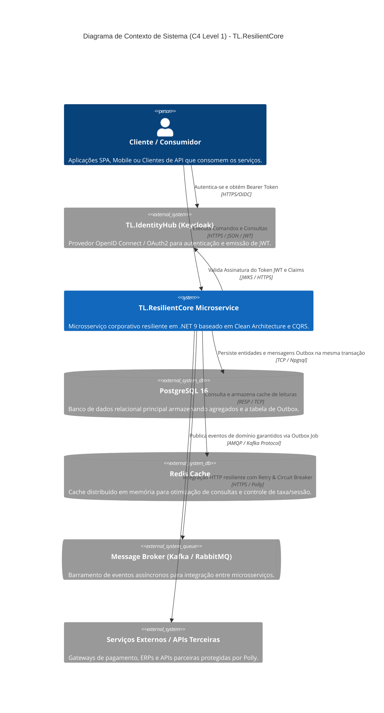
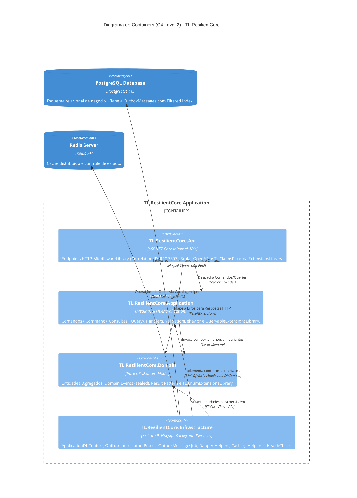
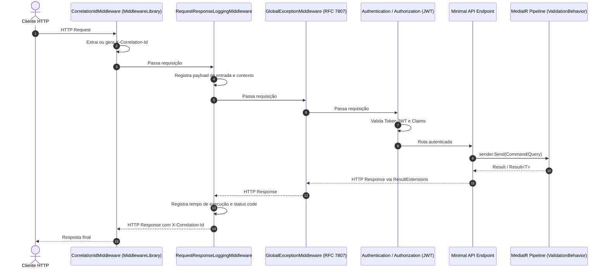
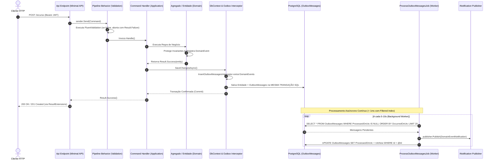

# 🏛️ Visão Geral da Arquitetura — TL.ResilientCore

O **TL.ResilientCore** é um Enterprise Microservice Starter Kit e Template para .NET 9 projetado sob os princípios de **Clean Architecture**, **Domain-Driven Design (DDD)**, **Command Query Responsibility Segregation (CQRS)**, **Design for Failure** e **Reutilização Inteligente de Bibliotecas**. 

O template foi concebido para cenários de alta criticidade, integridade transacional estrita e ambientes distribuídos orientados a eventos, eliminando falhas silenciosas e gargalos clássicos de microsserviços.

---

## 🎯 1. Diagrama C4 — Nível 1: Contexto do Sistema (System Context)

O diagrama abaixo ilustra os limites do sistema gerado pelo `TL.ResilientCore`, seus consumidores, serviços de suporte e integrações externas:

---

## 📦 2. Diagrama C4 — Nível 2: Containers & Componentes (Containers & Architecture)

A estrutura interna do `TL.ResilientCore` segue o isolamento concêntrico da **Clean Architecture**, onde o Domínio é o núcleo inviolável e a Infraestrutura e Apresentação integram as bibliotecas reutilizáveis do ecossistema:

---

## 🌐 3. Pipeline HTTP de Apresentação e Middlewares

O pipeline de requisições na camada `Presentation.Api` segue uma ordem estrita de execução garantindo observabilidade e padronização:

---

## 🔄 4. Fluxo de Execução e Garantia Transacional (Outbox Pattern)

O grande diferencial do `TL.ResilientCore` é a garantia de entrega **At-Least-Once** sem introduzir o risco de *Dual Write* ou travamentos no banco.

---

## 🧱 5. Detalhamento das Camadas e Bibliotecas Integradas

### 5.1. Camada de Domínio (`TL.ResilientCore.Domain`)
* **Isolamento Total**: Depende exclusivamente do runtime básico do .NET e bibliotecas utilitárias puras (`TL.EnumExtensionsLibrary`). Zero dependência de frameworks web ou ORMs.
* **Entidades Ricas (`Entity`, `AggregateRoot`)**: Construtores públicos são proibidos (testado via NetArchTest). O acesso e mutação de estado ocorrem estritamente por métodos de domínio que protegem suas invariantes.
* **Domain Events Imutáveis (`IDomainEvent`)**: Eventos são definidos como `sealed record`, garantindo imutabilidade e identificadores únicos (`EventId`, `OccurredOnUtc`).
* **Result Pattern (`Result`, `Result<T>`, `Error`)**: Todas as operações de negócio retornam `Result` ou `Result<T>`. Lançamento de exceções (`throw`) é proibido para regras de validação e restrições de negócio (vide [ADR-002](../adr/002-result-pattern.md)).

### 5.2. Camada de Aplicação (`TL.ResilientCore.Application`)
* **CQRS Puro**: Segregação de `ICommand` / `ICommandHandler` para mutações e `IQuery` / `IQueryHandler` para leituras.
* **Pipeline Behaviors**: O `ValidationBehavior<TRequest, TResponse>` intercepta comandos antes da execução, executa os validadores do `FluentValidation` e retorna erros estruturados caso existam inconsistências.
* **Extensões de Consulta LINQ**: `QueryableExtensionsLibrary` fornece métodos de paginação e filtragem condicional (`.ApplyFilterIf()`, `.ToPagedListAsync()`).

### 5.3. Camada de Infraestrutura (`TL.ResilientCore.Infrastructure`)
* **Entity Framework Core 9**: Mapeamento objeto-relacional com PostgreSQL via `Npgsql.EntityFrameworkCore.PostgreSQL`.
* **Outbox Pattern com Índices Filtrados**:
  * Configuração: `builder.HasIndex(x => x.OccurredOnUtc).HasFilter("\"ProcessedOnUtc\" IS NULL");`
  * O índice cobre exclusivamente mensagens pendentes, garantindo tempo de resposta constante `< 1ms` mesmo após milhões de registros históricos processados (vide [ADR-001](../adr/001-indices-filtrados-outbox.md)).
* **Background Worker (`ProcessOutboxMessagesJob`)**: `BackgroundService` que realiza polling em lotes com tratamento de exceções catastróficas e deserialização tipada de eventos.
* **Dapper & Cache**: Utilização de `CommonHelpers.Data.Dapper` para consultas ultra-rápidas e `DataHelpers.Caching.Helpers` para cache distribuído em Redis.
* **HealthCheck Probes**: Diagnóstico de conectividade com banco e cache via `CommonHelpers.HealthCheck`.

### 5.4. Camada de Apresentação (`TL.ResilientCore.Api`)
* **Minimal APIs Modernas**: Roteamento enxuto de alta performance.
* **Middlewares Corporativos**: `MiddlewareLibrary` configurando Correlation ID, logging estruturado e tratamento global RFC 7807 (ProblemDetails).
* **Scalar OpenAPI Reference**: Documentação interativa em `/scalar/v1` em substituição ao Swagger UI tradicional.
* **ResultExtensions**: Conversor funcional que transforma `Result` em `Results.Ok()`, `Results.BadRequest()` ou `Results.NotFound()` sem necessidade de blocos `try/catch`.
* **Autenticação JWT (Keycloak / TL.IdentityHub)**: Configuração padrão para consumo de tokens Bearer com extração de claims via `TL.ClaimsPrincipalExtensionsLibrary`.

---

## 🔺 6. Estratégia de Testes Automatizados

O template implementa a pirâmide completa de testes automatizados:

| Projeto | Tecnologia | Responsabilidade |
| :--- | :--- | :--- |
| **`TL.ResilientCore.ArchitectureTests`** | NetArchTest.Rules + xUnit | Valida o isolamento de camadas da Clean Architecture, garantia de imutabilidade dos Domain Events, convenções de sufixo CQRS e proteção de construtores de entidades. |
| **`TL.ResilientCore.UnitTests`** | xUnit + FluentAssertions | Testa comportamentos do Result Pattern, agregação de Domain Events e regras isoladas de domínio. |
| **`TL.ResilientCore.IntegrationTests`** | Testcontainers (PostgreSQL 16) + WebApplicationFactory | Sobe instâncias reais e efêmeras do PostgreSQL via Docker, aplica migrações EF Core no boot, e valida o fluxo HTTP da API e integridade da tabela Outbox. |

---

## 🛡️ 7. Decisões Arquiteturais Registradas (ADRs)

1. [ADR-000: Arquitetura Base e Convenções](../adr/000-arquitetura-e-convencoes.md)
2. [ADR-001: Uso de Índices Filtrados na Tabela Outbox](../adr/001-indices-filtrados-outbox.md)
3. [ADR-002: Adoção do Result Pattern em detrimento de Exceptions](../adr/002-result-pattern.md)
4. [ADR-003: Separação de Command e Query (CQRS)](../adr/003-cqrs-adoption.md)
5. [ADR-004: Restrições Arquiteturais, Idempotência e Anti-Patterns](../adr/004-design-for-failure.md)
